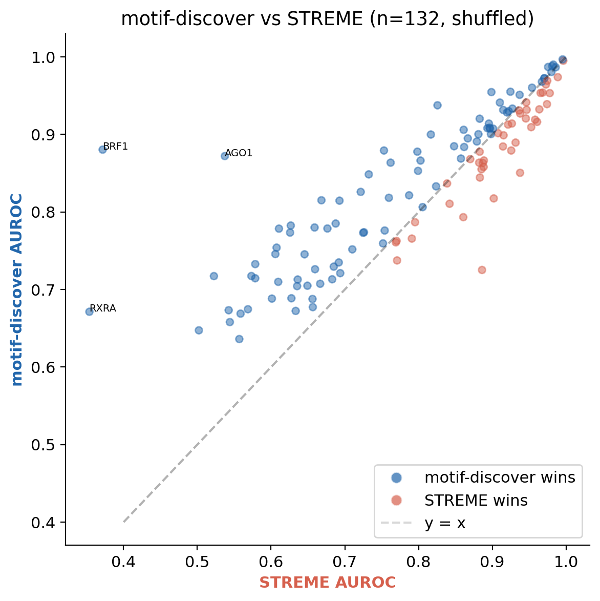
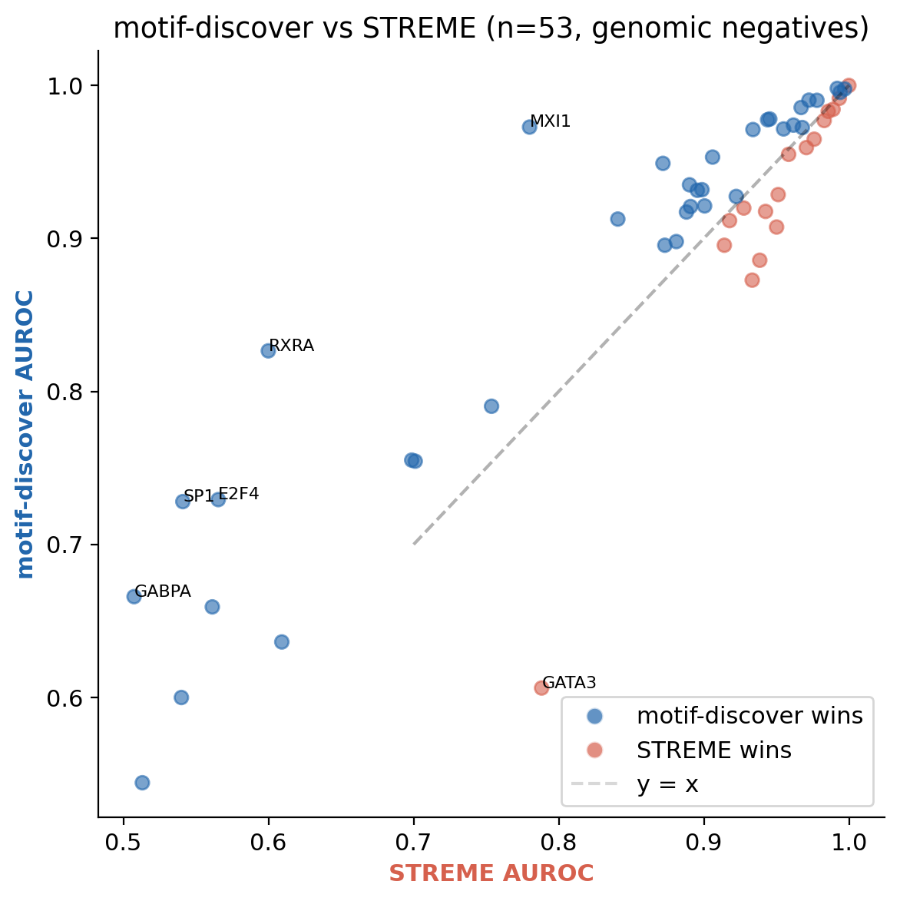
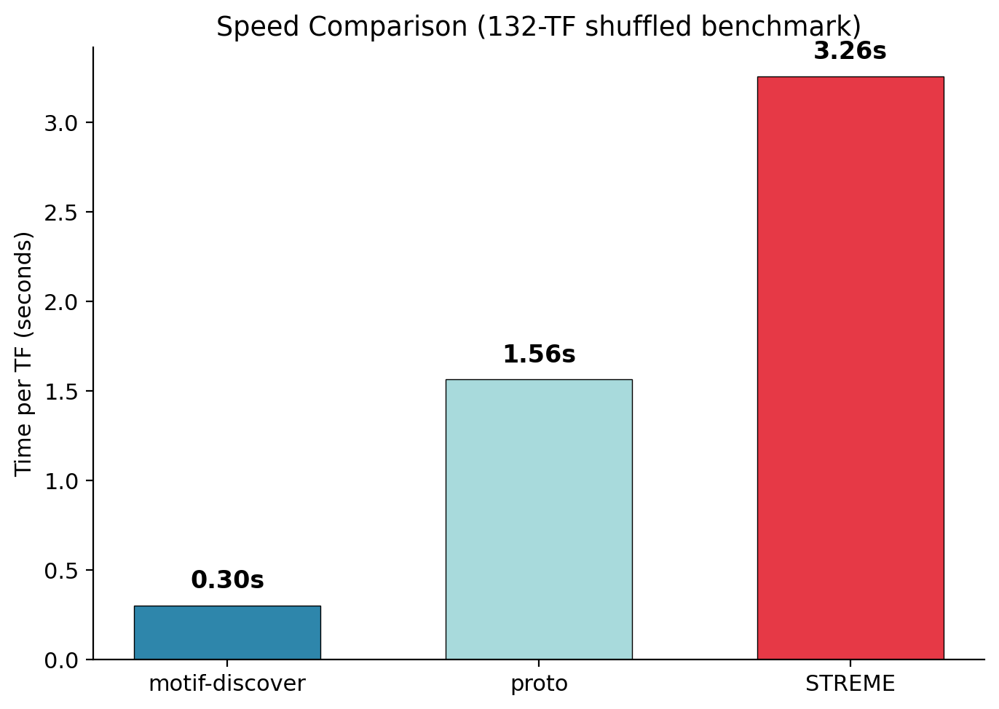
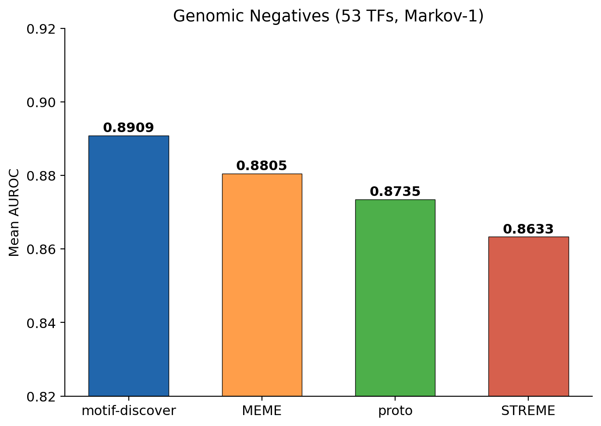

# motif-discover

**Fast, accurate de novo DNA motif discovery for ChIP-seq data.**

Distributed as a single 928 KB statically-linked binary — no dependencies, no compilation, no container required.

📄 **[Read the paper](paper/motif-discover.pdf)** — full benchmark details, statistical analysis, and biological validation

📊 **[Interactive notebook](demo_notebook.ipynb)** — reproduce all results and figures

[](https://colab.research.google.com/github/Travis42/motif-discover/blob/main/demo_notebook.ipynb)

---

## Key Results

Benchmarked on **132 ENCODE K562 ChIP-seq** transcription factor datasets against STREME 5.5.5, MEME 5.5.5, and proto-motif-discover (earlier prototype).

### Accuracy

| Benchmark | motif-discover | proto | STREME | MEME |
|-----------|:-------------:|:-----:|:------:|:----:|
| **Shuffled neg.** (132 TFs) | **0.842** | 0.843 | 0.803 | — |
| **Genomic neg.** (53 TFs) | **0.891** | 0.874 | 0.863 | 0.881 |

motif-discover significantly outperforms STREME on both benchmarks (Wilcoxon p = 4.1×10⁻⁷ and 6.5×10⁻⁴) and matches/exceeds MEME on genomic negatives — while running 11–15× faster than STREME and ~300× faster than MEME.

### Speed

| Tool | Per TF | Full 132-TF | vs. STREME |
|------|:------:|:-----------:|:----------:|
| **motif-discover** | **0.3s** | **~45s** | **11–15×** |
| STREME | 3.3s | ~7 min | 1× |
| MEME | ~90s | ~3 hr | 0.003× |

### Statistical Significance (vs. STREME)

| Test | Shuffled (132) | Genomic (53) |
|------|:--------------:|:------------:|
| Wilcoxon p | 4.1×10⁻⁷ | 6.5×10⁻⁴ |
| Cliff's δ | +0.31 | +0.38 |
| Win / Loss | 85 / 43 | 35 / 16 |

### Biological Validation (TOMTOM vs. JASPAR)

94% of discovered motifs match known JASPAR entries; 78% at statistical significance. Head-to-head, motif-discover achieves better match e-values than STREME in 52 of 97 comparable TFs. See the [paper](paper/motif-discover.pdf) for full details.

---

## Figures

<table>
  <tr>
    <td width="50%" align="center"><br/><sub>motif-discover vs. STREME — shuffled negatives (132 TFs)</sub></td>
    <td width="50%" align="center"><br/><sub>motif-discover vs. STREME — genomic negatives (53 TFs)</sub></td>
  </tr>
  <tr>
    <td width="50%" align="center"><br/><sub>Runtime per TF across tools</sub></td>
    <td width="50%" align="center"><br/><sub>Genomic negatives benchmark — mean AUROC</sub></td>
  </tr>
</table>

---

## Quick Start

```bash
git clone https://github.com/Travis42/motif-discover.git
cd motif-discover
chmod +x motif-discover
./motif-discover --data example/ --ours-only
```

The `example/` directory contains 11 ENCODE K562 ChIP-seq profiles. Runtime: ~4 seconds.

## Usage

```bash
./motif-discover --data <data_dir> [options]
```

| Option | Description |
|--------|-------------|
| `--data <dir>` | Directory containing `*_sequences.fa` files (500bp peak-centered) |
| `--tf <name>` | Specific TF, or `ALL` for every TF in the directory |
| `--markov` | Use Markov-1 background scoring (recommended for genomic negatives) |
| `--negatives <file>` | External negatives FASTA (e.g., hg38 genomic regions) |
| `--minw <n>` | Minimum motif width (default: 6) |
| `--maxw <n>` | Maximum motif width (default: 17) |

**Output (tab-separated):**

```
TF      Width   AUROC   Time_s  Source  P_value Pos_hit Neg_hit
```

## Running the Notebook on Colab

The notebook runs both motif-discover and STREME live on 11 ENCODE ChIP-seq datasets, then visualizes accuracy and speed differences:

1. Click the Colab badge above
2. Runtime → Run all
3. ~40 seconds later: per-TF AUROC comparison, scatter plot, and speed benchmark

Both binaries are included in the repo. Speed comparisons are relative to the Colab machine's CPU.

**On GitHub:** Clicking the notebook shows a static preview. To run it, use Colab or clone the repo and run locally with Jupyter.

## Requirements

- x86-64 Linux (kernel 3.2.0+)
- That's it. Statically linked, zero dependencies.

## Reproducibility

- `benchmark_data/` — Pre-computed AUROC results for all 132 TFs (shuffled and genomic, all tools)
- `demo_notebook.ipynb` — Jupyter notebook reproducing all figures and statistics
- `paper/` — Full LaTeX source and compiled PDF

All benchmarks use identical input data, scoring code, and negative sets across tools. Width range 6–17 bp. STREME and MEME invoked with standard parameters from MEME Suite 5.5.5.

## Contact

Travis Smith — travis.smith42@pm.me

Source code available upon request for academic collaboration.
